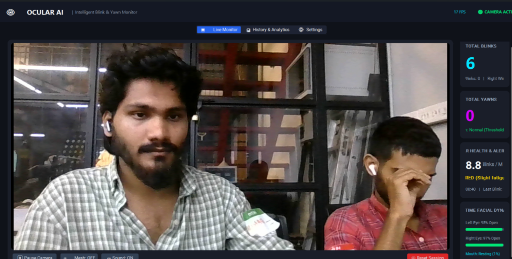

# Ocular AI. 🎯


## Basic Details
### Team Name: roqcodes


### Team Members
- Team Lead: Muhammed Ronak - SOE CUSAT
- Member 2: Muhammed Danish - SOE CUSAT
- Member 3: Mohammed Ramzan - SOE CUSAT

### Project Description
A delightfully over-engineered AI computer vision application that tracks how many times you blink your eyes and yawn throughout your day, keeping a permanent scorecard of your facial fatigue.

Powered by Google MediaPipe FaceLandmarker and a modern CustomTkinter Windows GUI, Ocular AI uses neural blendshapes and facial landmark geometry to detect voluntary and involuntary blinks, isolate left/right winks, and identify genuine yawns with a speech-immunity algorithm that ignores regular talking.

Every session is logged locally to an SQLite database, calculating your Blinks Per Minute (BPM), screen fatigue index, and lifetime counts, with one-click export to CSV for when you need to spreadsheet your tiredness.

### The Problem (that doesn't exist)
Humans have been blinking and yawning involuntarily thousands of times a day for hundreds of thousands of years without any computer vision algorithm keeping track of their biological eyelid closure or penalizing them with sound chimes. The existential dread of not knowing your exact daily blink count or whether that yawn was deep enough to qualify as a certified ergonomic event.

### The Solution (that nobody asked for)
A dedicated desktop application that hijacks your webcam, tracks 478 3D facial landmarks at 30 FPS, calculates Mouth Aspect Ratio (MAR) and neural eyelid blendshapes, enforces a 1.3-second continuous wide-jaw hold requirement so you can talk freely without accidentally triggering yawns, and stores your lifetime blink totals in a local SQLite database so you can prove to your friends just how exhausted you really are.

## Technical Details
### Technologies/Components Used
For Software:
- Python 3
- Google MediaPipe (FaceLandmarker, Neural Blendshapes, 478 3D Mesh Landmarks)
- OpenCV (Real-time Video Capture, Frame Transformation, BGR/RGB Pipelines)
- CustomTkinter (Modern Dark-Mode Windows Desktop GUI, Responsive Dashboard)
- SQLite3 (Local Session Data Storage & Lifetime Aggregations)
- Pillow (PIL Image Rendering & CTkImage Integration)
- NumPy (Euclidean Distance Calculations & MAR Geometry)
- VS Code, GitHub, PowerShell, and some brain.


### Implementation
For Software:
# Installation
```bash
git clone https://github.com/Danishx3/404.2.0.git
cd 404.2.0
pip install -r requirements.txt
```

# Run
- Double-click `Launch_App.bat` or the desktop shortcut
- Or run in terminal: `python gui_app.py`
- Or run windowed mode (no console): `pythonw app.pyw`
- Or run the classic HUD mode: `python blink_counter.py`

### Project Documentation
- **Live Monitor**:
  - Launch the application to start the camera feed.
  - Look into the camera. Every natural bilateral blink increments your **Total Blinks**.
  - Try winking with only your left or right eye — the app isolates **Left Winks** and **Right Winks** without false blinks.
  - **Speech Immunity Test**: Speak, converse, or read aloud normally (mouth openness stays around 15%–35%). Notice the mouth gauge registers speech, but the yawn counter will NOT trigger.
  - **Yawn Test**: Open your mouth wide (`> 58%`) and hold continuously for 1.3 seconds — watch the live countdown `😮 YAWNING... (1.3s / 1.3s)` confirm the yawn with a gentle melodic chime!
- **History & Analytics**:
  - View lifetime summary totals (Lifetime Blinks, Lifetime Yawns, Total Sessions, Hours Tracked).
  - Inspect every past tracking session in a scrollable table with timestamps, durations, and fatigue ratings.
  - Click **Export to CSV** to save history for spreadsheet analysis.
  - Click **Clear History** to purge old database logs with full confirmation prompt and live counter reset.
- **Settings**:
  - Adjust Mouth Open Threshold and Required Continuous Hold sliders.
  - Adjust Blink Eye Closure Trigger sensitivity.
  - Test audio feedback with instant **Test Blink Sound** and **Test Yawn Sound** buttons.
  - Switch camera device index on the fly.

# Screenshots (Add at least 3)

The Live Monitor dashboard displaying real-time webcam feed, blink/yawn counters, BPM health gauge, and facial dynamics progress bars.


Speech-immune yawn detection in action with real-time continuous hold progress bar and face mesh overlay.


History & Analytics dashboard featuring lifetime aggregate statistics, session log table, CSV export, and clear history controls.

# Diagrams

Webcam Video Stream (OpenCV 30 FPS)
-> MediaPipe FaceLandmarker Task (CPU Inference)
-> Extract Blendshapes (eyeBlinkLeft, eyeBlinkRight, jawOpen) + 478 3D Landmarks
-> Compute Ensemble Mouth Aspect Ratio (MAR) + Geometric Lip Separation
-> State Machine Engine:
   - Hysteresis Debounce (40ms - 600ms) -> Emit Blink / Left Wink / Right Wink
   - Speech Rejection (< 58% ignored) + Continuous Hold Filter (>= 1.30s) -> Emit Yawn
-> Non-Blocking Audio Player (winsound chimes)
-> CustomTkinter GUI Desktop Dashboard (Live Cards, Viewport, Sliders)
-> Local SQLite Storage (`data/blink_history.db`) -> History Table & CSV Exporter

## Team Contributions
- Muhammed Ronak: Researched MediaPipe FaceLandmarker blendshapes, neural blink debouncing algorithms, and audio cues.
- Muhammed Danish: Built the multi-threaded CustomTkinter desktop GUI, 400px metrics cards, and SQLite storage manager with CSV exporter.
- Mohammed Ramzan: Engineered the speech-immune ensemble yawn detection logic (MAR + jawOpen + continuous hold) and UI styling.
---
Made with ❤️ at TinkerHub Useless Projects 


